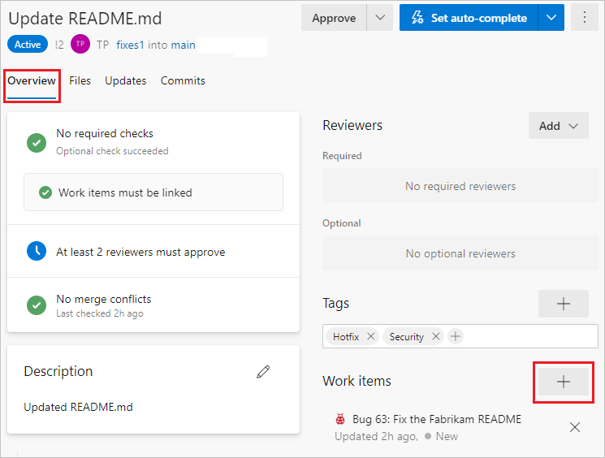
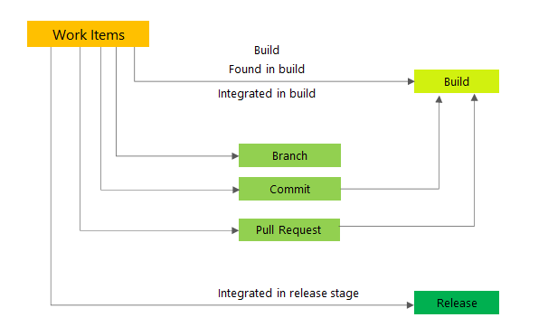
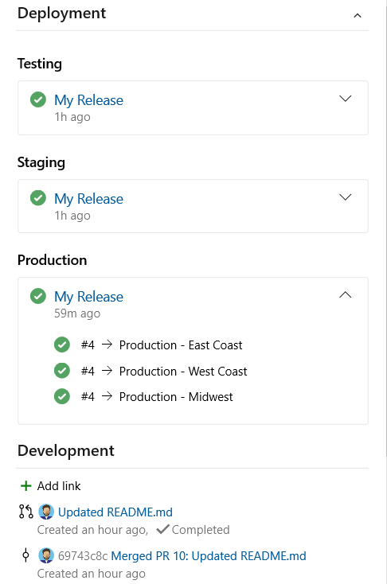
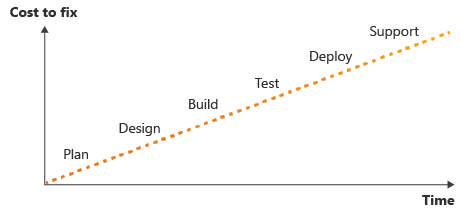
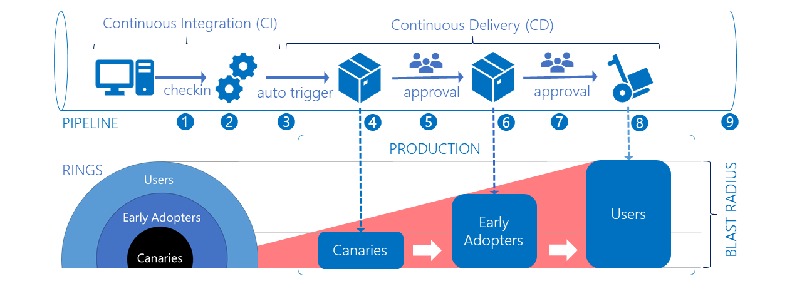

# **Platform-centric DevOps Practices**

---

# **Table of contents**

  - [**Communities of Practice**](#communities-of-practice)
  - [**Team Autonomy**](#team-autonomy)
  - [**Coaching and Organizational Support**](#coaching-and-organizational-support)
  - [**Continuous Integration (CI)**](#continuous-integration-ci)
    - [**Repository Branching**](#repository-branching)
    - [**Pull Requests**](#pull-requests)
      - [**End-to-end Traceability**](#end-to-end-traceability)
      - [**Change Management**](#change-management)
    - [**Testing**](#testing)
      - [**Unit Testing**](#unit-testing)
      - [**Linting**](#linting)
      - [**Vulnerability Checking and Secrets Management**](#vulnerability-checking-and-secrets-management)
    - [**Work Item Acceptance**](#work-item-acceptance)
    - [**Release Management**](#release-management)
  - [**Continuous Delivery (CD)**](#continuous-delivery-cd)
    - [**Deployment Rings**](#deployment-rings)
    - [**Blue/Green Deployments**](#bluegreen-deployments)
    - [**Feature Flagging**](#feature-flagging)

---

## **Communities of Practice**

When adopting the DevOps culture, it is crucial to establish communities of practice. Using a model similiar to [open-source software (OSS)](https://en.wikipedia.org/wiki/Open-source_software), central, or platform-based teams are setup to manage content and collaborate with developers, analysts, and other contributors from external teams. By doing so, the business is able to take advantage of lessons learned during the development of a work product and leverage those assets across the company, saving time and resources, while minimizing service degradation and outages.

Sometimes two platform teams are created to work in tandem, with the idea that they work as a check and balance for each other, ensuring a playful competitive nature that inspires and empowers innovation, and helps prevent the teams from becoming complacent or falling back into learned habits. Typically they are the "platform" team and the "center of excellence" team who share the same product leadership.

## **Team Autonomy**

Individual and team autonomy is the cornerstone of highly productive and qualitative product delivery teams. Autonomous teams are synomous with self-organizing, self-managing, or empowered teams.

One of the earliest references to autonomous teams comes from a research book published in 1981 on English coal miners, and describes it as: "Teams of 10 to 15 cross-trained individuals guided by the corporate vision, motivated by peer-pressure, and taking on the responsibilities of their former supervisors."

Autonomy refers to the team being provided freedom by leadership and management to complete their work, and for the individual to assert that autonomy in their everyday work to accomplish the goals and vision of the business with a sense of shared-purpose.

Cross-fertilization is the concept of the team being composed of individuals with different specializations, behaviors and thinking so that during the course of these individuals interaction they can improve their understanding of each other's perspective, which generally leads to better or higher quality outcomes.

Self-transendence is the concept of individuals on a team to self-evaluate their performance, set better goals, and design better solutions to achieve their personal and shared goals.

Contrary to the terms described above, this does not mean leadership or management becomes irrelevant. In fact, they become far more crucial to the team success, and take on more of a coaching role rather than a command & control approach. For most intents and purposes, individual success becomes shared team success, and the focus should be on creating work that is interdependent within the autonomous team rather than not. This focus will drive individual engagement, accountability, and higher quality outcomes.

Accordingly, autonomous teams can flounder if not proactively supported by leadership, and providing them a high level of autonomy could reduce the teams overall effectiveness in delivering value to the business if they are not adequately supported, or if the wrong metrics are used to track delivery of value. The actual performance of the team relies heavily on management providing organizational context to the work being performed, essentially creating a feeling of shared-purpose or shared-goals.

Reference: [Autonomous agile teams: challenges and future directions for research](https://dl.acm.org/doi/10.1145/3234152.3234182)

## **Coaching and Organizational Support**

Leadership and management must provide organizational context and support, otherwise the individuals will struggle to come up with the shared-goal, and when they do complete work, they do not get the sense of accomplishment they otherwise would have, and possibly deliver work that does not realize long-term value for the business.

By not providing adequate organizational context, it can lead to situations where the individual becomes too dependent on other teams to provide the context for them, which means they will not deliver the desired outcome, or it could prevent them from completing their work altogether. Because of this, trust between individual and leader starts to erode, as from the individuals perspective, they are asked to do increasingly difficult work without any ideas as to the goal being achieved.

If you have experienced individuals pushing blame or communicating many constraints as to why their work cannot be completed, this is a strong indicator that not enough context is being provided by leadership when the work was assigned, and leadership needs to align with the business goals and provide more context to establish shared-goals within the team.

During the process of defining context and giving work meaning, it can become apparent that architectural design or strategy becomes cumbersome and leads to unnecessary feedback loops or dependencies, where most of the time is spent planning what will be delivered rather than actually delivering anything of value. This is a crucial aspect that is often skipped and can lead to stalled or blocked work, failing to deliver work during an iteration, or even completely cutting the user story after time has already been wasted.

Coaching is the act of inspiring others to come up with solutions and pinpointing the challenge that individual is encountering. Those individuals are the closest to the work being completed, and so their knowledge on the subject is critical in coming up with a solution to the problem. Stoking their thought process to view the problem from different points of view is critical in unblocking work.

Lastly, informal rules or norms become a problem when regulating team behavior. Typically, a working agreement that all individuals and leadership agree to is required to prevent the team from going off in directions that are not desirable. An example [Working Agreement](Working-Agreement.md) is available.

## **Continuous Integration (CI)**

Continuous integration is the process of building and/or testing code each and every time someone makes changes to the `main` branch of source control management (SCM), such as `Git`. The `main` branch is considered the `production` branch and should be able to deploy services at any given time where reasonable.

There are some cases where it is not desirable for the `main` branch to be deployable, such as when creating new products or even large new features. While the principal of making the `main` branch deployable to production at any time, in practice, the `release` tag is the instrument that will be used to deploy to the product into the production environment(s). More about `release` tags can be found in the [Release Management](#release-management) section.

### **Repository Branching**

The most widely adopted branching strategy is the [Trunk Based Development](https://trunkbaseddevelopment.com/) approach because of its simplicity, high-velocity, and reduction of merge conflicts which usually result in significant delays to deliver work, and require many members of the team to stop working in order to help resolve the conflicts.

```
A source-control branching model, where developers collaborate on code in a single branch
called `trunk*`, resist any pressure to create other long-lived development branches by
employing documented techniques. They therefore avoid merge hell, do not break the build,
and live happily ever after.

* main or master, in Git nomenclature
```


As the graphic demonstrates, all individual contributors create a branch based on their assigned work item(s) when they start the work, and it's now considered `Work In Progress` (WIP). The individual who created the branch is the owner of that work, and should be the primary collaborator even if others are working on the same story in order to ensure that the branch is eventually merged into the `main` branch. It is that individuals responsibility to ensure that regardless of what happens to the user story, the branch is deleted during or shortly after closing the iteration. If the user story spans multiple iterations, a new branch should be created and the work `cherry-picked` into the new branch. Failing to do this has a high probability that merge conflicts will result, and must be avoided.

While an individual is working on a branch, they should regularly monitor for new changes to the `main` branch and pull those changes to their local branch to prevent most merge conflicts. At the minimum, individuals must pull new changes from the `main` branch at the beginning of their work day, and resolve any conflicts that may arise from upstream changes. If in the process of pulling changes from the `main` branch, they should work to resolve any conflicts that come from the changes.

If there are many merge conflicts when an individual is doing their work, then this is an indicator that something has gone wrong during Agile planning and suggests that duplicate work is happening. If this is the case, bring it to the attention of the Agile Coach, sometimes referred to as Scrum Master, and have a conversation with all individuals making changes that are creating the merge conflicts.

The most common nomenclature for these individual branches ties it together with the Agile work items that are assigned.

Features: `feat/description`

Bug: `bug/description`

Hotfix: `hf/description`

You can have additional identifiers, such as the work item number, but these can quickly diverge from the work being performed, such as if the work item splits into multiple, the work item changes during the iteration, the work item is cut during Agile planning, or the work is not delivered in a given Agile iteration.

It is not recommended to create a branch with an identifier for the individual performing the work. The primary reasons are because the individual could be reassigned to a different task, they could take time-off or sick-leave during the work, or even someone else contributing to the work item. Instead of relying on the branch name to identify the individual(s) performing the work, use references to the user account that made the commit.

Note: the user account making changes is identified through the `Pull Request` process as well.

### **Pull Requests**

Protecting the `main` branch from undesirable behavior is crucial to the integrity and quality of the product and the ability to deploy services to production. One of the primary methods for protecting the `main` branch is to require `Pull Requests`, which is synonomous with code review or peer review. The `Pull Request` process allows automated tests to run and return the results so that time is not wasted during the review of changes that don't function as intended. The `Pull Request` also prevents the individual who created the changes from circumventing the process of committing changes to the `main` branch without peer-review.



The above graphic depicts an example of what a `Pull Request` looks like. There are only two policies assigned to this particular example and include requiring the `Pull Request` has linked user stories, and that at least 2 reviewers must approve.

Other policies that can be assigned include:

- Requiring that the `Pull Request` starts the CI process and that it successfully passes all tests and builds the artifacts.
- Prevent the individual who created the `Pull Request` from approving their own work.
- Require all comments to be resolved or accepted before merging is allowed.
- Templates can be used for [Definition of Done](Definition-of-Done.md) and includes a checklist directly in the `Pull Request`.

The `Pull Request` also allows you to make direct comments on changes that have been made, and to provide clarity or context to code that is not immediately understandable. This process of commenting in `Pull Requests` has the side benefit of allowing individuals who are not experts in a certain area to learn from their peers.

The `Pull Request` also provides a high level of traceability since it shows all git commits that have been included in the request. This allows anyone reviewing the `Pull Request` to immediately view what code or changes have been made, and to pinpoint their origin.

#### **End-to-end Traceability**

It is critical for the `Product Owner` to see and understand the work being performed and ultimately delivered. The best way to ensure that the `Product Owner` has visibility into this is to create direct links with the repository & `Pull Requests` that are being used to deliver the work.

These links must be provided in the work item that is delivering the feature, bug, or hotfix. They should also provide status information such as the last time work was committed to the branch, the status of the `Pull Request` that delivers the work, and if the work is being actively deployed to an environment. It should also include the `Pull Request` number when it's created so that it contains the history of when and where the work was delivered, and who reviewed the delivery via the `Pull Request`.



The above graphic demonstrates at a high-level what information should be included in the work item. This allows the `Product Owner` or `Agile Coach` to simply look at the work item to determine status and alert them when they need to take action to ensure timely delivery.

Being able to determine where work is deployed is critical to understanding what has been delivered to customers or end-users. It also provides a single pane of view for product leadership to determine the quality of delivery and if it's acceptable to meet the desired outcome of the user story.




The above graphic shows an example of what it would look like with these deep links required for end-to-end traceability and the work that was performed. At the top, you can see which environments the work is deployed to and the deployments real-time status. In this case, all deployments are green, which assumes that CI/CD was successful and tested the work, built or package the application, and then subsequently deployed the artifacts.

Below that, you can see the exact branch that the individual working on the user story created, and the `Pull Request` which, in this case, also displays that it has been merged. By clicking on any of these links, it allows anyone to immediately go to the CI/CD pipeline, the code that was committed, or even the `Pull Request` and who might have approved it for merging.

These examples and more can be found here: [Azure DevOps Work Tracking - End-to-end Traceability](https://docs.microsoft.com/en-us/azure/devops/cross-service/end-to-end-traceability)

#### **Change Management**

All of these changes can be fed through a Change Management service, such as ServiceNow. By doing so, most of the processes involved in creating changes can be automated, and the Change Advisory Board (CAB) can have extremely granular views into the changes that are being made.

The quality of the information provided to CAB is a necessary stop-gap to preventing unintended changes. An example of some of the information that can be automatically added to the change in something like ServiceNow is any Infrastructure-as-Code changes that might affect resources, in particular authentication methods.

This automation creates immutable change tracking and allows for advanced deep auditing of changes being made to the environment. The outcome then can be subsequently tracked through monitoring systems, which would allow detection of unapproved or "rogue" changes occuring outside of the Change Management process.

Lastly, the actual code that is being changed can be incorporated in the Change Management process, and any artifacts that come from the CI/CD pipeline will be documented and can be referenced back to their original source. In light of supply-chain attacks such as what happened to SolarWinds, this is a crucial component to tracking what is being deployed in the environment, and to track the source of those changes.

### **Testing**

Testing early and often during development is necessary to maintaining and delivering high-quality products. The concept of "Shift left" requires, among other things, unit testing to ensure desired outcomes and that defects are identified early in the process instead of during peer-review or `Product Owner` acceptance, or worst case scenario in production.

It's a heavily researched rule that in software or infrastructure development that the earlier in the process that you find an error, the easier, quicker, and cheaper it is to fix. The later in the process that you catch an error or problem, the harder and more complicated it is to fix. The below graphic visualizes this concept. The earlier you are able to catch these issues, the lower the cost to remediate them is.



#### **Unit Testing**

The design of a `Unit Test` is to narrowly target the work that is being completed to minimize the potential for defects later in the release cycle. If there any any external dependencies, such as libraries or packages that must be built, external connections to databases or other live applications, that is not considered a `Unit Test` and could cause automated tests or CI/CD pipelines to fail with a false positive.

A proper unit test should also take a few seconds to run at most, and ideally be run in milliseconds. If unit testing takes longer than that, it indicates there are problems with the code being written and refactoring may be required. Alternatively, it could indicate that the test is actually an integration or external test, and should only be included in the `Unit Test` as a mocked version of that dependency.

Typically if a `Unit Test` requires an external dependency, such as a connection to a database, then a mocking framework should be used in place of that dependency. For example, if it's a SQL database connection, then something like SQL in-memory can be utilized on the build agent that's running the `Unit Test` which would act as if it was the external SQL database.

A couple examples of a `Unit Test`:
- If you were designing a method to do simple math addition, you would take a known input such as 1 + 1 and call the method, and if the method returns anything other than 2 it should fail.
- If you were designing Infrastructure-as-Code, a unit test could be defining a resource, such as a Web App, and by running validation you could determine if the example output created a Web App, and what the desired configuration of it was. If the output of validation deviates from the input, then the test should fail.

#### **Linting**

Linting is the process of syntax and styles checking. When dealing with Infrastructure-as-Code (IaC) such as ARM Templates, Azure Bicep, Terraform, CloudFormation and others, it is crucial to perform linting prior to deployment of the infrastructure. Failing to do this could result in undesirable effects, such as changing one resource but not others, implementing a dependency that fails to deploy, or even removing quotas or limitations that could lead to overspending on resources.

Styles are important for readability and maintainability of code. Problems occur when a different style is used among developers working in the same code base. By having standards for code styles, it makes it easier to collaborate and understand what your peers are doing without having to meet with them to understand their code. The process of linting and style checking removes barriers to deployment of services and applications, significantly reducing both time to deploy and catch defects introduced during development.

The process of linting helps with the concept of Don't Repeat Yourself (DRY) in that it will be more apparent when code is repeated. Establishing patterns is directly valuable to the business and allows code to be shared across organizations instead of just within the team.

Linting can also ensure consistency with parameters and arguments, and this is especially useful when using CI/CD tooling that relies heavily on runtime parameters to change the behavior of deployments, or when applications use Operating System Environment Variables.

#### **Vulnerability Checking and Secrets Management**

In modern development, it is common to use upstream packages or applications that are not authored by the product team, such as open-source software (OSS). Services such as SonarQube are able to validate that known vulnerabilities are mitigated by alerting the product team that an upstream package being used to deliver their product contains vulnerabilities, and if those issues are acceptable or not.

In addition, poorly managed secrets (such as password, private keys or other private credentials) is one of the leading causes of cybersecurity breaches. Preventing such secrets from being checked-in to a code repository is paramount to keeping this sensitive information out of malicious actors hands.

The first method is to manage .gitignore files which prevent certain files from being committed to the repository. For example, if using a file named `secrets.py`, you would add an entry in the .gitignore file to contain this file name. In most cases, this would prevent those secrets from being included when an individual is committing changes to the repository.

The second method is to perform static code analysis to determine is secrets are being committed to the repository. This is essential to keeping these secrets out of the product in case an individual makes a mistake, or does not follow the accepted pattern for storing secrets used by an application.

Wherever possible, any secrets or other sensitive information should be stored in a secrets management vault that is specific to the product using these secrets. Services such as `Azure Key Vault` provides the capability for the application to retrieve those secrets itself, but also for an individual developing the application to use their own account to store and retrieve these secrets so they do not store this sensitive information on their workstation. 

Storing secrets for an application is essential, but so is preventing the individual from storing those secrets locally is just as important. There have been multiple high-profile news headlines about cybersecurity breaches, and ultimately those stories are about developers storing secrets on their workstation in order to develop applications.

### **Work Item Acceptance**

The `Product Owner` is the gatekeeper for accepting or rejecting work items, usually in the form of `User Stories`.

If the work item delivers work product (artifacts) outside of source control, the artifact should be uploaded to a permanent location and instructions on retrieving the artifact or a hyperlink should be applied to the work item. If a suitable permanent location is not available, the artifact should be attached to the work item delivering the artifact.

If the work item delivers artifacts that are inside of source control, the team member must initiate a `Pull Request` to the `main` branch. The `Product Owner` should be notified that they have a pending request to review the `Pull Request` and either accept or reject it based on peer-review feedback of the `Pull Request`.

In most cases, the peer-review can be done by any other individual on the team, including the `Product Owner`. If subject matter expertise is required, it is recommended to work with the individual that initiated the `Pull Request` to determine if it delivers on the acceptance criteria of the work item, and sometimes a demonstration of the work is necessary to satisfy the requirements. If the initiator is not available, than another subject matter expert should be identified and consulted to determine if the `Pull Request` delivers on the work item acceptance criteria.

The individual(s) reviewing the `Pull Request` should use a Definition of Done [(example)](Definition-of-Done.md) checklist to ensure that any gaps are identified before the `Pull Request` is accepted. If minor changes are required, it is not necessary to reject the `Pull Request` and instead the initiator should make the changes, and notify the reviewers that the work has been completed. If major changes are required, the `Pull Request` should be rejected and a new one must be initiated once the work has been completed.

### **Release Management**

The responsibility of tagging a release is that of the `Product Owner`. During the Agile iteration closing ceremonies, the `Product Owner` figuratively or literally declares the `main` branch complete for the iteration, and if production release is necessary, will proceed to tag the `commit` with the iterations release number. Tagging of the branch is usually delegated to a team member familiar with `git` and can appropriately select the `commit` to apply the necessary release tag. The release tag can be the same as the iteration number, or if using iteration schemes that do not reflect `release` tags, the `release` tag for an iteration should be determined at the start of the Agile iteration.

Generally, the `main` branch is the same as the `release`, however, sometimes it is necessary to `cherry-pick` specific commits for production release, usually in the event of needing a `hotfix` that is necessary to resolve a problem or defect. It is up to the `Product Owner` to determine exactly what would need to be `cherry-picked` and moved into the production release. There are other cases as well that could make the `release` diverge from the `main` branch, such as implementing new features, or conceptual work that only implements a feature partway.

This release tag will be used as the basis for versioning any artifacts that are produced by the CI process(es), and any subsequent Continuous Delivery (CD) process(es) will utilize packages that are created from the `commit` that is tagged with the release version.

Conceptually, in the event of losing the artifacts or needing to reproduce the chain of events, this allows the product to be released back into production as if the artifacts were not affected by an event. On occasion, this can also be used to recreate to artifacts during regression testing if a bug or defect is introduced into production, and to validate that the CI process is consistent.

## **Continuous Delivery (CD)**

Continuous Delivery is the process to build, test, configure and deploy from a build artifact created during the CI stages into a `production` environment. The CD part of a CI/CD pipeline deploys to several stages, typically labeled as `Development` (Dev), `Test` (Test), and `Production` (Prod). When code is being merged, the `Pull Request` itself should create a new environment in which to deploy artifacts so that basic testing on real and temporary resources can be conducted, or in some cases to perform advanced regression testing as needed.

The earlier stages should go more rapidly and run a smaller subset of automated tests, such as `Unit Tests`. The "lower" environments typically have lower capacity, such as less CPU cores, memory, storage, and network bandwidth. If  Successive environments run longer tests each time, such as load, integration, and user acceptance tests.

### **Deployment Rings**

Multiple deployments should be sequenced progressively into more resources. The first ring is typically considered the `canary` ring, which is a reference to when coal miners would use a canary bird to detect noxious gases before they harmed humans. In most circumstances, the `canary` ring should catch any catastrophic errors or failures before they impact all end-users. The `canary` ring should be comprised of users that are subject matter experts (SMEs), test managers or leads, and product managers or owners. The `canary` ring should be used as a gate to prevent deployment to further stages until enough of the deployment has been validated that it is unlikely to cause problems when deployed to the progressive rings.


The graphic above visualizes what the typical deployment rings look like. The `canary` ring is typically only used by the product team to determine quality of the release. Early adopters is the first wave of individuals that are not in the product team delivering the work. Finally, Users are the end-users that will be utilizing the product for their regular work.



This graphic demonstrates what a typical CI/CD pipeline would look like, and how it relates to the different rings. As outlined, it shows that the `canary` ring is automatically deployed once code is merged into the `main` branch, and the subsequent rings have approval gates. These gates can be automated, but that would be determined solely by the `Product Owner` and executive leadership.

Note: There can be compliance concerns as well in determining whether or not automatic approval and subsequent deployments can be enabled. It is up to the `Product Owner` to determine compliance requirements.

It is critical that monitoring is enabled and can adequately detect issues before moving to the progressive rings. The below graphic provides a high-level overview of a dashboard that can show these metrics, and would allow `Product Owners` to determine the health of their services.


### **Blue/Green Deployments**

`Blue/Green` deployments is a strategy for progressively deploying a new instance of production service(s). The `Blue` environment implies that this is the current running production service. `Green` implies the new environment that is created as a staging area for the new changes.

`Blue/Green` deployments are rapidly becoming the strategy for releasing changes to production. This technique allows very rapid rollout and rollback capabilities. When the `Green` environment is deployed, it allows users or traffic to slowly be migrated to the new instance of the production service, and typically is incremented in percentages of users. For example, as the service stabilizes you can slowly increase the percentage of users going to the new instance, starting with 10% and increasing by 10% every hour until all users have been successfully migrated to the `Green` environment.

Once it is determined that the new instance of the production service is stable, the `Blue` environment is turned off and deleted, and the `Green` instance is relabeled to become the new `Blue` environment. And, as this example suggests, the deployment can be quickly and easily rollback if it's determined the new changes are not stable or cause catastrophic issues.

### **Feature Flagging**

Feature flagging is the practice of creating new features that are enabled by utilizing `Environment Variables`. These environment variables can be changed, or toggled, while a service is running without requiring a new deployment or any changes to the application itself.

From an iterative standpoint, this is the best way to manage implementing brand new features that have not yet been adopted by the end-users of the service. There are numerous issues with feature flags, but the best way to deal with these problems is to plan for using feature flags before they are implemented, and ultimately, determine whether or not you should use a feature flag in the first place.

For example, if you decide to use a feature flag the purpose should be very clear, such as releasing a new feature across multiple Agile iterations. Likewise, if you do decide that a feature flag is necessary, ensure that a plan is in place to remove the feature flag once the feature is fully implemented. Having feature flags last throughout the lifecycle of a feature is the number one cause of problems.

If feature flags have multiple dependencies, such as a database schema or different version of an external service, that should be taken into consideration before using the feature flag. Sometimes, managing two sets of a database is cost prohibitive, so it should not be done.

Feature flags should be very clearly defined in the code when they are being used. If the new feature calls any existing methods or functions, those functions should be duplicated and use the same feature flag mechanism. Any extremely simplified feature flag looks like this:

```
if (featureFlag) {
    // Run this code block if the featureFlag value is true
} else {
    // Run this code block if the featureFlag value is false
}
```

Feature flags should always be a boolean value, that is `True` when the feature is enabled, and `False` when it is disabled. Likewise, during deployment, it should be ensured that the `Environment Variable` is created on the deployment target and set to `False`, and when making a call to the new method(s) or function(s), override the `Environment Variable` with `True`. One of the benefits of using [Blue/Green Deployments](#bluegreen-deployments) is that you can filter a small percentage with the feature flag set to `True`, which allows insights into how the new feature is functioning, and more importantly, the feature can be turned off very rapidly.

Feature flagging is especially useful if you want to enable `Preview` capabilities for a service, which would allow the end-user to toggle a specific feature on or off.
